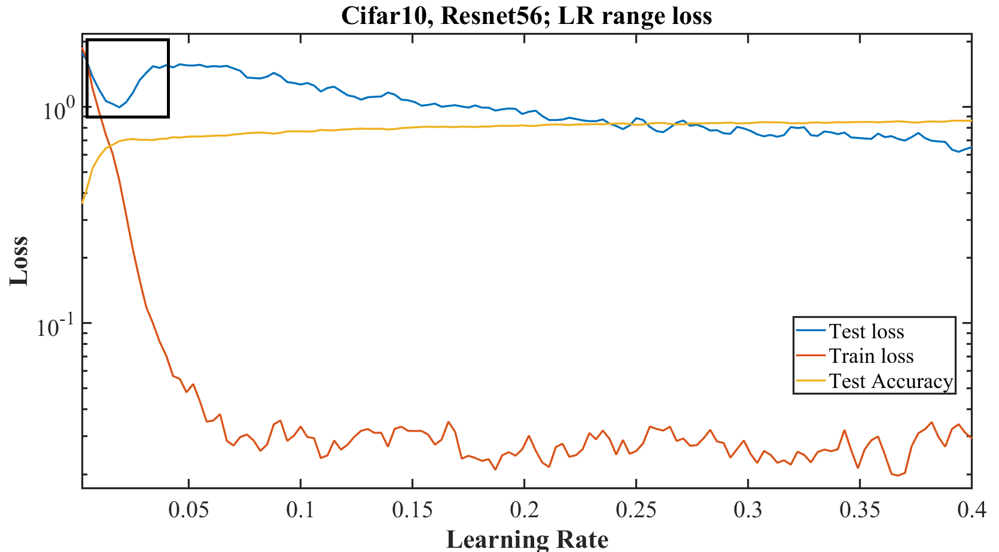

## Intro

Scott Mueller

###### smueller.tampa.ai@gmail.com

---
## Tampa.ai

Looking for Presenters

---
## A disciplined approach to neural network hyper-parameters: Part 1 – learning rate, batch size, momentum, and weight decay

https://arxiv.org/abs/1803.09820

---
* Super Convergence
* R1: Unreasonable Effectiveness of Validation/Test Loss
* R2: Horizontal Part of Test Loss
* Underfitting
* Overfitting
* Cyclical Learning Rates

---
* R3: Amount of Regularization Must Be Balanced
* R4: Highest Performance Minimizing Computational Time
* R5: Optimial Momentum Improves Network Training
* R6: Weight Decay is Key Knob for Tuning Regularization
* Short Recipe

---
## Super Convergence

---
## Cyclical Learning Rate vs One Cycle

---
## Unreasonable Effectiveness OF Validation/Test Loss

---
## R1: Test Loss Indicator of Network's Convergence

---
## Underfitting

---
## R2: Horizontal Part of Test Loss

---
## Learning Rate Range Test

---
## Overfitting

---
## Cyclical Learning Rate

---
## One Cycle

---
## R3: Amount of Regularization Must Be Balanced

* Large Learning Rates

* Small Batch Sizes

* Weight Decay

* Dropout

---
## Batch Size Effect on Test Loss

---
## R4: Highest Performance Minimizing Computational Time

---
## R5: Optimial Momentum Improves Network Training

Momentum Rate Finder Not Useful

---
## Cyclical Momentum Opposite of Learning Rate Cycle

High Momentum when LR small, vice versa

---
## R6: Weight Decay is Key Knob for Tuning Regularization

Easier to determine best WD from test loss

---
## Everything Together

---
## Short Recipe

* Learning Rate Range Test - Determine Max LR
 
  - Use 1 Cycle

* Batch size from your GPU size

* Cyclical Momentum in opposite direction from Cyclical LR

* Weight Decay - Grid Search to 1 significant figure

  - Complex datasets less regulation so smaller values 0.0001 - 0.000001

---
## Hyperparameter Clues are in Test Loss - Early in Training

---
## One Cycle Focused on Adam Optimization

* Newer Optimizations may Require Different Approaches

  - Ranger (High LR for a while & Cosine Decay)

---

[Knowfalls.com](https://knowfalls.com/team.html)

###### scottmueller@knowfalls.com

Looking for Founder Engineers

Elixir, Functional Programming, Rails, Experience

---

https://iconof.com/1cycle-learning-rate-policy
